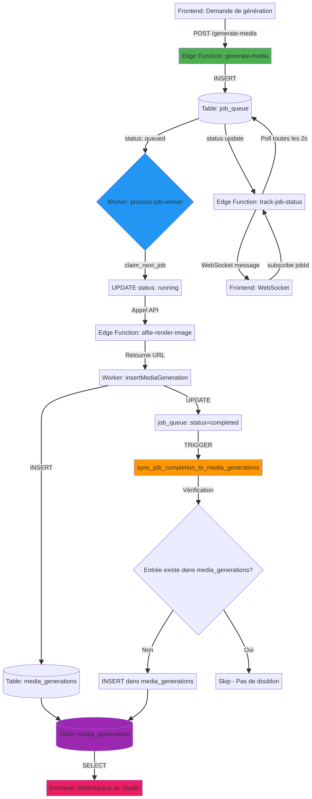

# 🔧 Réparation du Flux de Génération d'Images - Alfie Designer

## 🎯 Objectif

Réparer le flux de génération d'images pour que **toutes les images générées apparaissent automatiquement dans la bibliothèque du Studio**.

## ⚡ Démarrage Rapide

### 1. Déployer les corrections

```bash
# Déployer les fonctions Edge
supabase functions deploy generate-media
supabase functions deploy track-job-status

# Appliquer la migration
supabase db push

# Tester
./test_generation_flow.sh
```

**Temps estimé : 15 minutes**

### 2. Vérifier que tout fonctionne

```bash
# Créer un job de test
curl -X POST https://your-project.supabase.co/functions/v1/generate-media \
  -H "Authorization: Bearer YOUR_TOKEN" \
  -H "Content-Type: application/json" \
  -d '{
    "userId": "uuid-user",
    "brandId": "uuid-brand",
    "kind": "image",
    "prompt": "Un magnifique paysage"
  }'

# Vérifier dans la base de données
psql -c "SELECT * FROM job_queue ORDER BY created_at DESC LIMIT 1;"
psql -c "SELECT * FROM media_generations ORDER BY created_at DESC LIMIT 1;"
```

## 📊 Diagramme du Flux Réparé



## 📁 Fichiers Modifiés

| Fichier | Type | Description |
|---------|------|-------------|
| `supabase/functions/generate-media/index.ts` | Modifié | Insère maintenant dans `job_queue` |
| `supabase/functions/track-job-status/index.ts` | Modifié | Lit depuis `job_queue` |
| `supabase/migrations/20251123_fix_media_generation_flow.sql` | Nouveau | Trigger de synchronisation |

## 📚 Documentation

| Document | Description |
|----------|-------------|
| **[FLUX_GENERATION_REPAIR.md](FLUX_GENERATION_REPAIR.md)** | Documentation technique complète du flux |
| **[DEPLOYMENT_GUIDE.md](DEPLOYMENT_GUIDE.md)** | Guide de déploiement étape par étape |
| **[CHANGES_SUMMARY.txt](CHANGES_SUMMARY.txt)** | Résumé des modifications |
| **[test_generation_flow.sh](test_generation_flow.sh)** | Script de test automatisé |

## 🔍 Problèmes Résolus

### ❌ Avant

```
Frontend → generate-media → jobs (table incorrecte)
                              ↓
                           ⚠️ Le worker ne voit pas le job
                              ↓
                           ❌ Rien dans media_generations
                              ↓
                           ❌ Pas d'image dans le Studio
```

### ✅ Après

```
Frontend → generate-media → job_queue
                              ↓
                           Worker traite le job
                              ↓
                           INSERT dans media_generations
                              ↓
                           Trigger de secours (si échec)
                              ↓
                           ✅ Image visible dans le Studio
```

## 🧪 Tests

### Test Manuel Rapide

```bash
# 1. Créer un job
JOB_ID=$(curl -s -X POST https://your-project.supabase.co/functions/v1/generate-media \
  -H "Authorization: Bearer $TOKEN" \
  -H "Content-Type: application/json" \
  -d '{"userId":"'$USER_ID'","brandId":"'$BRAND_ID'","kind":"image","prompt":"Test"}' \
  | jq -r '.jobId')

echo "Job créé: $JOB_ID"

# 2. Attendre le traitement (5-30 secondes)
sleep 10

# 3. Vérifier le résultat
psql -c "SELECT status FROM job_queue WHERE id = '$JOB_ID';"
psql -c "SELECT output_url FROM media_generations WHERE job_id = '$JOB_ID';"
```

### Test Automatisé

```bash
./test_generation_flow.sh
```

## 🚀 Flux Complet

### Étape 1 : Création du Job

**Frontend** appelle `generate-media` :
```typescript
POST /functions/v1/generate-media
{
  userId: "uuid",
  brandId: "uuid",
  kind: "image",
  count: 1,
  ratio: "1:1",
  prompt: "Un chat mignon"
}
```

**Résultat** : Job créé dans `job_queue` avec `status = 'queued'`

### Étape 2 : Traitement par le Worker

**Worker** `process-job-worker` :
1. Récupère le job via `claim_next_job()`
2. Passe le statut à `'running'`
3. Appelle `alfie-render-image`
4. Insère dans `media_generations`
5. Passe le statut à `'completed'`

### Étape 3 : Trigger de Sécurité

**Trigger** `sync_job_completion_to_media_generations` :
- Se déclenche quand un job passe à `'completed'`
- Vérifie si l'entrée existe déjà dans `media_generations`
- Si non, crée automatiquement l'entrée
- **Garantit que l'image apparaît toujours dans le Studio**

### Étape 4 : Notification Frontend

**WebSocket** `track-job-status` :
- Envoie des mises à jour en temps réel
- Notifie quand le job est complété
- Frontend rafraîchit la bibliothèque

## 🛡️ Fiabilité

### Protection contre les Échecs

| Scénario | Solution |
|----------|----------|
| Worker échoue à insérer dans `media_generations` | Trigger de secours insère automatiquement |
| Doublon potentiel | Index unique + vérification avant insertion |
| Job bloqué en `'queued'` | Logs détaillés + fonction de nettoyage |
| Performance dégradée | Index optimisé sur `(job_id, output_url)` |

### Compatibilité

✅ **Compatibilité ascendante** : Les anciennes entrées dans la table `jobs` (système de carrousels) ne sont pas affectées

✅ **Pas de régression** : Le système de carrousels via chat continue de fonctionner normalement

✅ **Migration sûre** : Le trigger ne s'active que sur les nouveaux jobs complétés

## 📈 Monitoring

### Requêtes Utiles

```sql
-- Nombre de jobs par statut
SELECT status, COUNT(*) FROM job_queue GROUP BY status;

-- Jobs échoués récents
SELECT id, error, created_at 
FROM job_queue 
WHERE status = 'failed' 
ORDER BY created_at DESC 
LIMIT 10;

-- Images générées aujourd'hui
SELECT COUNT(*) 
FROM media_generations 
WHERE created_at >= CURRENT_DATE;

-- Jobs en attente depuis > 5 minutes
SELECT id, created_at, NOW() - created_at AS waiting_time
FROM job_queue 
WHERE status = 'queued' 
  AND created_at < NOW() - INTERVAL '5 minutes';
```

### Logs Supabase

- **Edge Functions** : Dashboard → Logs → Edge Functions
- **PostgreSQL** : Dashboard → Database → Logs
- **Rechercher** : `[generate-media]`, `[process-job-worker]`

## 🔄 Rollback

En cas de problème, consulter la section **Rollback** dans [DEPLOYMENT_GUIDE.md](DEPLOYMENT_GUIDE.md).

```bash
# Supprimer le trigger
psql -c "DROP TRIGGER IF EXISTS trigger_sync_job_to_media ON job_queue;"

# Restaurer les anciennes versions
git revert HEAD
supabase functions deploy generate-media
supabase functions deploy track-job-status
```

## 📞 Support

### En cas de problème

1. ✅ Consulter [FLUX_GENERATION_REPAIR.md](FLUX_GENERATION_REPAIR.md)
2. ✅ Consulter [DEPLOYMENT_GUIDE.md](DEPLOYMENT_GUIDE.md)
3. ✅ Vérifier les logs Supabase
4. ✅ Exécuter `./test_generation_flow.sh`
5. ✅ Contacter l'équipe avec les logs d'erreur

### Checklist de Validation

- [ ] `generate-media` déployée
- [ ] `track-job-status` déployée
- [ ] Migration appliquée
- [ ] Trigger créé
- [ ] Index créé
- [ ] Test manuel réussi
- [ ] Images visibles dans le Studio

## 🎉 Résultat Attendu

Après déploiement, **toutes les images générées apparaîtront automatiquement dans la bibliothèque du Studio**, avec :

- ✅ Traçabilité complète (job_id)
- ✅ Métadonnées enrichies
- ✅ Protection contre les doublons
- ✅ Fiabilité maximale (trigger de secours)
- ✅ Performance optimisée (index)

---

**Date** : 23 novembre 2024  
**Auteur** : Manus AI  
**Version** : 1.0  
**Statut** : ✅ Prêt pour déploiement
